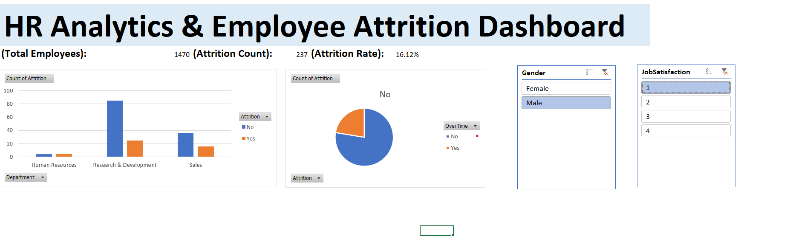

# 📊 HR Analytics & Employee Attrition Dashboard (Excel)

## 📌 Project Overview
This project analyzes employee attrition trends within an organization to identify key factors driving employee turnover and suggest data-backed retention strategies using Excel.

## 🛠️ Tools Used
- **Microsoft Excel:** Data Cleaning, Pivot Tables, Dynamic Charts, KPI Cards, and Dashboard Design

## 🔑 Key Metrics & Insights
- **Overall Attrition Rate:** Analyzed baseline turnover across departments.
- **Department Dynamics:** R&D and Sales showed high attrition tied to overtime and job roles.
- **Income & Experience:** Employees with lower monthly income bands and 1-3 years at the company faced the highest risk of leaving.
- **Satisfaction Scores:** Direct correlation found between low Job Satisfaction/Work-Life Balance ratings and turnover.

## 📈 Dashboard Preview

## 💡 Recommendations
1. Re-evaluate overtime policies for high-attrition job roles.
2. Structure career growth frameworks for employees in their first 3 years.
3. Conduct competitive salary benchmarking for entry-to-mid-level roles.# HR-Employee-Attrition-Analytics
HR Analytics &amp; Employee Attrition Dashboard built using Advanced Excel
